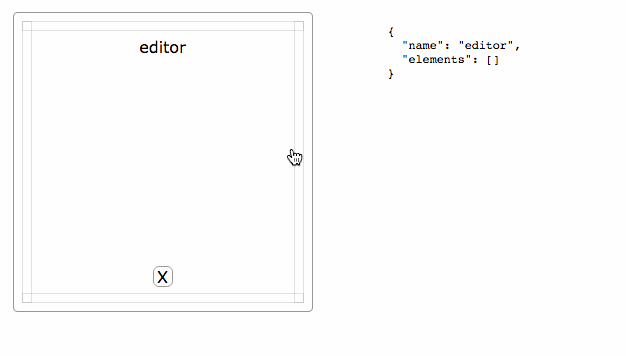

# Layout-Architect :rocket: [demo](https://krasimir.github.io/layout-architect/)

A small utility for building custom layouts.

* Written in vanilla JavaScript.
* Works with finite number of layout blocks.
* No dependencies.



| File          | Size           
| ------------- |:-------------
| [la.min.css](https://unpkg.com/layout-architect@latest/la.min.css)    | 1.3KB
| [la.min.js](https://unpkg.com/layout-architect@latest/la.min.js)     | 4.0KB

Check out the demo [here](https://krasimir.github.io/layout-architect/).

## Installation

### JavaScript:

`npm install layout-architect` or `yarn add layout-architect`

or you can grab a .js file directly here [https://unpkg.com/layout-architect@latest/la.min.js](https://unpkg.com/layout-architect@latest/la.min.js)

### CSS

The CSS that the module uses:

```
.la{position:relative;width:100%;height:100%}.la-block{box-sizing:border-box;height:100%;max-width:100%;max-height:100%;overflow:hidden;text-align:center;position:relative}.la-block a.la-remove{position:absolute;bottom:1em;left:calc(50% - 10px);display:none;border:solid 1px #999;text-decoration:none;color:#000;border-radius:6px;width:20px;text-align:center}.la-block a.la-remove:hover{border:solid 1px #000}.la-block:hover a.la-remove{display:block}.la-block a.la-left,.la-block a.la-right,.la-block a.la-top,.la-block a.la-bottom{opacity:.3;position:absolute;border:solid 1px #999;box-sizing:border-box}.la-block a.la-left:hover,.la-block a.la-right:hover,.la-block a.la-top:hover,.la-block a.la-bottom:hover{opacity:1;background:#000}.la-block a.la-left{top:0;left:0;height:100%;width:10px}.la-block a.la-right{top:0;right:0;height:100%;width:10px}.la-block a.la-top{top:0;left:0;width:100%;height:10px}.la-block a.la-bottom{bottom:0;left:0;width:100%;height:10px}.la-children{display:grid;height:100%;padding:1em}.la-name{margin-top:1em;margin-bottom:.5em}.la-selector{box-sizing:border-box}.la-selector a{box-sizing:border-box;text-decoration:none;color:#000;display:block;text-align:center;border:solid 1px #e2e2e2;width:100%;padding:.4em}.la-selector a:hover{background-color:#e2e2e2}
```

it is also available here [https://unpkg.com/layout-architect@latest/la.min.css](https://unpkg.com/layout-architect@latest/la.min.css)

## Usage

The library accepts a DOM elements as a first argument, list of strings as a second argument and an initial state as a last one. The array of strings contains the layout blocks that the user will be able to choose from. The initial state is a plain JavaScript object that matches the layout-architect [DSL](https://en.wikipedia.org/wiki/Domain-specific_language). For example:

```json
{
  "elements": [
    {
      "name": "editor",
      "elements": []
    },
    {
      "elements": [
        {
          "name": "output",
          "elements": []
        },
        {
          "name": "console",
          "elements": []
        }
      ],
      "direction": "horizontal"
    }
  ],
  "direction": "vertical"
}
```

This is the format of the data which gets in and out of the library. Here is a simple usage:

```html
<link rel="stylesheet" href="https://unpkg.com/layout-architect@latest/la.min.js">
<script src="https://unpkg.com/layout-architect@latest/la.min.css"></script>

<script>
  const la = LayoutArchitect(
    document.querySelector('#container'),
    ['editor', 'output', 'console', 'notes']
  );

  la.onChange(layout => {
    // ...
  });
</script>
```

## API

`LayoutArchitect` returns an instance with three methods:

* `onChange(<function>)` - register a callback function which gets fired every time the layout is updated.
* `change(<new state>)` - update the layout
* `get()` - returns the layout

